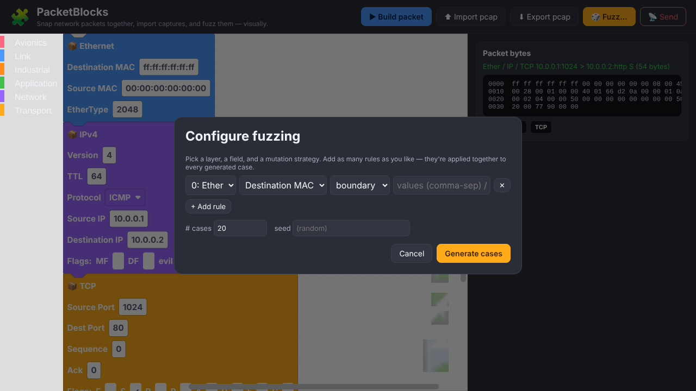

# 🧩 PacketBlocks

A **Scratch-style visual editor for network packets**, powered by Python + Scapy.

Snap protocol blocks together like LEGO, import real captures (`.pcap` from
tcpdump or Wireshark), watch the bytes update live, and **fuzz any field
visually** — so people can *see* how a packet is built and what changes when you
mutate it. Runs in a single Docker container, identically on **Windows, macOS and
Linux**.



---

## Why

Packet crafting with Scapy is powerful but intimidating. PacketBlocks puts a
kid-friendly, drag-and-drop front end on top of it:

* **Visual stack** — each layer is a colored block (`Ethernet`, `IPv4`, `TCP`…)
  that snaps onto the one above it, top-down, the way the protocol stack really
  nests.
* **Live bytes** — every change re-renders the real packet and a hexdump.
* **Import captures** — load a `.pcap`/`.pcapng` and each packet becomes an
  editable block stack.
* **Visual fuzzing** — drop fuzz rules on fields (boundary values, bit-flips,
  random, wordlists, length sweeps) and generate N mutated packets; each case
  shows exactly which field changed.
* **Uncommon protocols too** — not just the usual TCP/IP, but aerospace and
  industrial buses that Scapy doesn't ship: **ARINC 429**, **ARINC 664 / AFDX**,
  **MIL-STD-1553**, **CAN**, **Modbus/TCP**, **PROFINET RT** — and it's easy to
  add more (see below).

> ⚠️ **Scope & ethics.** PacketBlocks is for learning, lab work, and
> **authorized** security testing. Building and *visualizing* packets is always
> safe (nothing goes on the wire). Actually **transmitting** frames is disabled
> by default and must be explicitly enabled — use it only on networks and devices
> you own or have written permission to test.

---

## Quick start (Docker — recommended)

```bash
cd packetblocks
docker compose up --build
# then open http://localhost:8089
```

That's it. The same command works on Windows (Docker Desktop / WSL2), macOS
(Docker Desktop) and Linux.

### Capturing packets to import

Capture with your usual tools, then drag the file into the **Import pcap** button:

```bash
# tcpdump
sudo tcpdump -i eth0 -w capture.pcap

# or just use Wireshark and "Save As… .pcap"
```

A ready-made `samples/sample.pcap` is included to try the import flow.

---

## Running without Docker (dev mode)

```bash
cd packetblocks
pip install -r requirements.txt
cd backend
python app.py
# http://localhost:8089
```

Requires Python 3.9+.

---

## Transmitting on the wire (optional, Linux, authorized use only)

Sending is **off** unless you opt in. On a Linux host:

```bash
docker compose --profile live up --build
```

This runs with `--network host` and `NET_RAW`/`NET_ADMIN` and sets
`PACKETBLOCKS_ALLOW_SEND=1`. The **Send** button will then transmit the current
packet (or an imported/fuzzed set). There is a hard cap
(`PACKETBLOCKS_MAX_SEND`, default 500) on how many frames one request may send.

Host networking and raw sockets are not available on Docker Desktop for
Windows/macOS, so the **Send** feature is Linux-host only. Building, importing and
fuzzing work everywhere.

---

## How it fits together

```
frontend/                  Scratch-style UI (Blockly, vendored for offline use)
  index.html
  js/blocks.js             builds draggable blocks from the protocol catalogue
  js/app.js                build / import / export / fuzz / send wiring
  css/style.css
  vendor/blockly/          pinned Blockly 10.4.3 (no CDN needed)
backend/
  app.py                   Flask API
  builder.py               block stack  <->  Scapy packet
  fuzzer.py                field-level mutation engine
  protocols/
    registry.py            common protocols (delegated to Scapy)
    raw_protocols.py       ARINC 429/664, MIL-STD-1553, CAN, Modbus, PROFINET…
Dockerfile
docker-compose.yml
```

### API (if you want to script it)

| Method | Path                | Purpose                                   |
|--------|---------------------|-------------------------------------------|
| GET    | `/api/protocols`    | block catalogue (common + specialist)     |
| POST   | `/api/build`        | block stack → hex + summary + decode      |
| POST   | `/api/import-pcap`  | upload capture → block stacks             |
| POST   | `/api/export-pcap`  | block stacks → downloadable `.pcap`       |
| POST   | `/api/fuzz`         | base stack + rules → mutated cases        |
| POST   | `/api/send`         | transmit (gated by `PACKETBLOCKS_ALLOW_SEND`) |

---

## Adding your own protocol

**If Scapy already has it** — add an entry to `SCAPY_PROTOCOLS` in
`backend/protocols/registry.py` listing the fields you want as blocks. No other
code needed; the block and toolbox entry are generated automatically.

**If it's exotic** (not in Scapy) — add an entry to `RAW_PROTOCOLS` in
`backend/protocols/raw_protocols.py` with a field list, then implement `pack()`
(and optionally `describe()` for the inspector). It will show up as a block,
build into bytes, ride under Ethernet/UDP/etc., export to pcap, and be fuzzable —
all for free.

Example skeleton:

```python
RAW_PROTOCOLS["MYBUS"] = {
    "label": "My Bus",
    "category": "Industrial",
    "color": "#FF8C19",
    "fields": [
        {"name": "addr", "label": "Address", "type": "int", "default": 1, "bits": 8},
        {"name": "data", "label": "Data", "type": "bytes", "default": ""},
    ],
}
# in pack():  if name == "MYBUS": return struct.pack(">B", addr) + data_bytes
```

---

## License

See the repository `LICENSE`.
